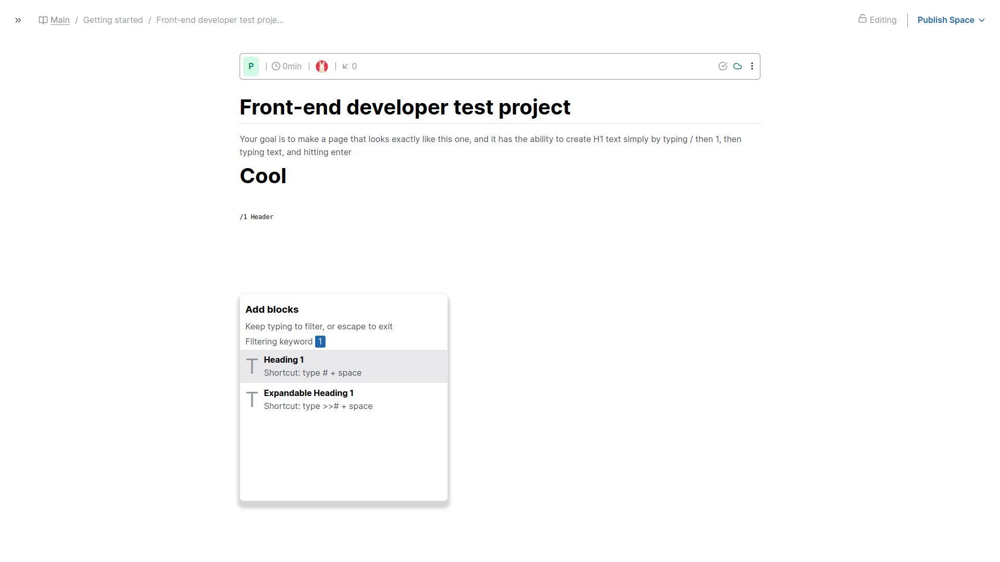

# Frontend Developer Test Project

Welcome to the Frontend Developer Test Project! This application demonstrates a basic text editor with a modal interaction, allowing users to create H1 elements dynamically.



## Features

- **Dynamic Text Editor:** Type `/` followed by a number 1 or 2 and text then hit enter to create H1 elements.
- **Modal Interaction:** A modal appears when typing `/`, offering additional options.
- **Keyboard Navigation:** Use the keyboard to interact with the modal and create elements.

## Technologies Used

- HTML
- CSS
- JavaScript
- Cypress (for testing)

## Getting Started

Follow these instructions to clone the repository, run the app, and execute tests.

### Prerequisites

Make sure you have the following installed on your local machine:

- [Node.js](https://nodejs.org/) (v12 or higher)
- [npm](https://www.npmjs.com/)

### Clone the Repository

1. Open your terminal.
2. Clone the repository using the following command:

    ```bash
    git clone https://github.com/kelvinbush/frontend-dev-test-project.git
    ```

3. Navigate to the project directory:

    ```bash
    cd frontend-dev-test-project
    ```

### Install Dependencies

Install the required dependencies by running:

```bash```
npm install

### Run the App

Run the application by running:

```bash
npm start
```

### Run the Tests

Run the tests by running:

```bash
npm  test
```
